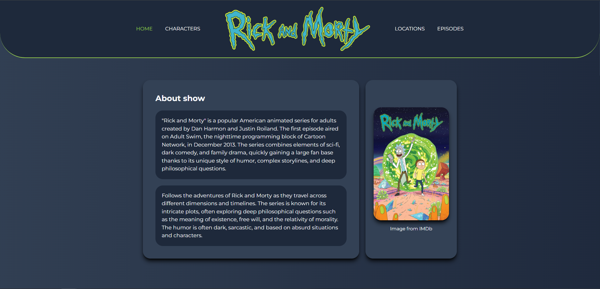
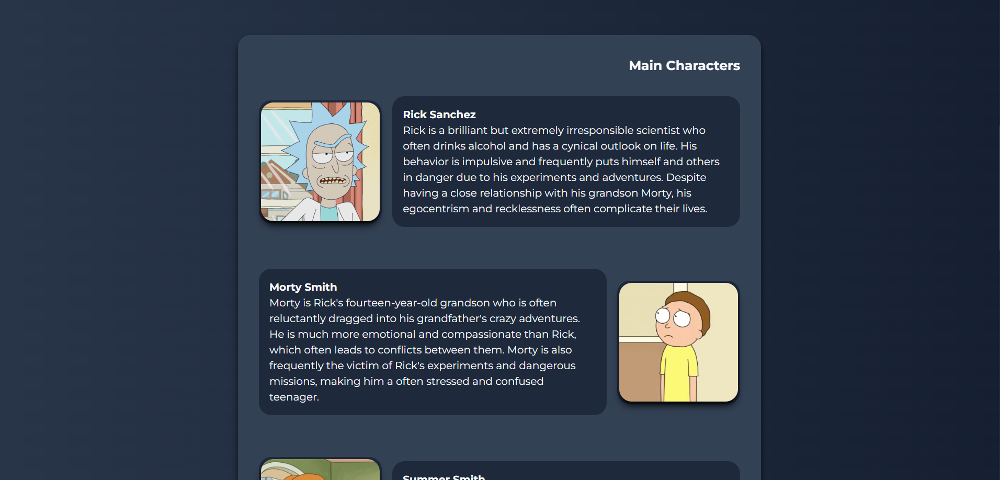
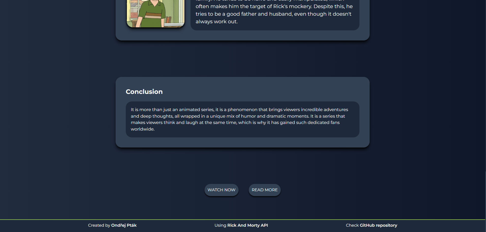

# Rick And Morty Web Using API
- Still in development

## Description

Built on Vite React and TailwindCSS, this web app uses the public Rick and Morty API to display information about characters, episodes, and locations from the show.

## Technologies

Vite, ReactJS, TailwindCSS, React Router, Axios, Framer Motion

## Installation

Steps for local installation and startup

```bash
# Clone repository
git clone https://github.com/florixak/RickAndMortyReactApp.git

# Go to project folder
cd rick-and-morty-react-vite-app

# Install needed libraries
npm install

# Run the app
npm run dev
```

## Functions

Here are the main features of this web app:

- Character Information: Get detailed information about characters from the Rick and Morty show, including their name, species, status, and origin.
- Episode Information: Explore episodes from the show, including their title, air date, and episode number.
- Location Information: Discover different locations featured in the Rick and Morty universe, including their name, type, and dimension.
- Search Functionality: Use the search bar to quickly find specific characters, episodes, or locations based on their ID.
- Responsive Design: The web app is designed to be responsive and work seamlessly on different devices, including desktops, tablets, and mobile phones.
- Smooth Transitions: Enjoy smooth page transitions and animations powered by Framer Motion, enhancing the overall user experience.
- Easy Navigation: Use the navigation menu to switch between different sections of the app and explore the content effortlessly.
- External API Integration: The app utilizes the Rick and Morty API to fetch and display the latest data, ensuring that the information is always up to date.
- Custom Styling: The app is built using TailwindCSS, allowing for easy customization and ensuring a visually appealing interface.
- User-friendly Interface: The app is designed with a user-friendly interface, making it intuitive and easy to navigate for users of all levels of technical expertise.

Feel free to explore these features and enjoy the world of Rick and Morty!

## Sample of work
(Warning) Images can be different through the development!
- Live Preview: [Rick And Morty](https://rick-and-morty-op.netlify.app/)

- Home page:




- Character page:
- Location page:
- Episode page:

## Thanks

- Thanks to [Rick and Morty API](https://rickandmortyapi.com/) for providing data.

## Links

- [Rick and Morty API](https://rickandmortyapi.com/)
- [Rick and Morty Logo](https://en.m.wikipedia.org/wiki/File:Rick_and_Morty.svg)
